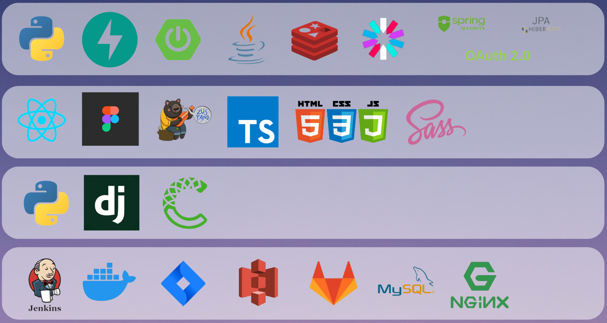
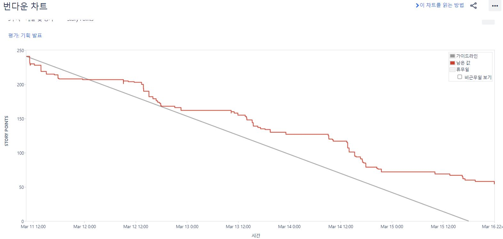
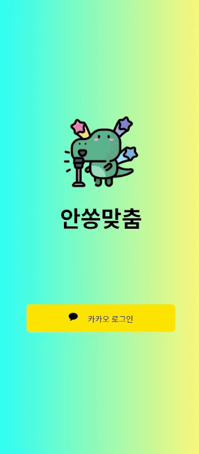
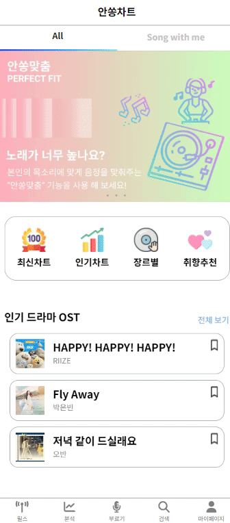
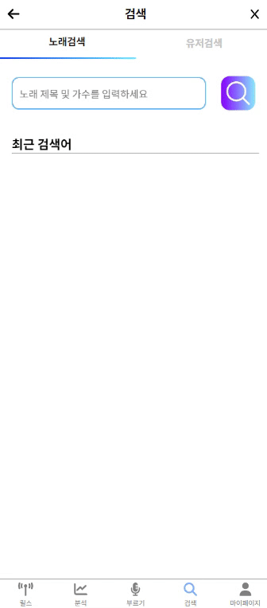
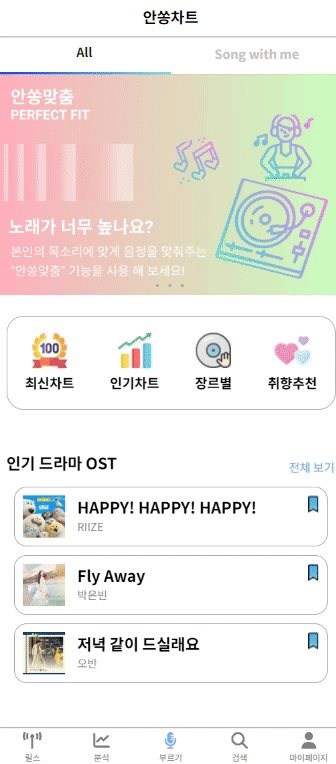

## 1️⃣ 프로젝트 개요

🌈 **개발 기간**

| 개발 기간 | 2024.02.26 ~ 2024.04.04(6주)|
| --- | --- |

🌈 **팀원 소개**

| 팀원 | 역할 |
| --- | --- |
| 김혁일 | 팀장, BE 리드, Infra(CI/CD), DB |
| 김재훈 | BE, 크롤링, DB, 서기 |
| 문신웅 | FE, 디자인, ,스크럼 마스터 |
| 박희찬 | AI, 크롤링, DB |
| 전재완 | BE, DB, 발표, Jira 담당자 |
| 정유나 | FE 리드, 디자인 |

## 2️⃣ 주요 기능

🌈 **노래 부르기**
- 싱글모드와 듀엣모드로 나눠져 노래를 부르고 저장할 수 있습니다.
- 부르는 도중 학습시킨 내음성을 기반으로 음정을 낮추거나 높혀줍니다.

🌈 **릴스**
- 부른 노래를 릴스로 만들어 모두와 공유할 수 있습니다.

🌈 **노래,릴스 추천**
- 찜이나 노래를 부른 기록에 맞춰서 부를 노래 추천이 가능합니다.
- 시청한 릴스를 기반으로 릴스가 추천되어 시청할수 있습니다.

## 3️⃣ API 명세서,기술 스택 및 아키텍처
- ### [API 명세서(Notion)](https://spark-pudding-194.notion.site/API-3c265388d59c417aa08ca0b19c162809?pvs=4)

- ### 기술 스택

- ### 아키텍쳐

---

## 4️⃣ 협업 환경

- ### Gitlab
    - 코드 버전 관리
    - 이슈 발행, 해결을 위한 토론
    - git-flow 방식 활용

- ### JIRA
    - 
    - Scrum Poker를 사용하여 Story Point 설정
    - 3Deps 구조를 활용하여 진행
    - 팀원들의 역할 진행도 확인

- ### 회의
    - 매일 아침 스크럼 회의를 통하여 전날 목표 달성량과 당일 할 업무 브리핑

- ### Notion
    - 이슈 사항 기록
    - 컨벤션 정리
    - api 명세서 정리

- ### Figma
    - 목업 제작, 와이어프레임 제작

- ### Miro
    - 아이디어 회의

- ### Canva
    - 발표 PPT 공유

## 5️⃣ 구현 내용

- ### 로그인, 초기 설정 및 음성 분석

- 
---
- ### 다양한 차트

- 
---
- ### 찜 및 추천 차트

- 
---
- ### 분석 화면

- 
---
- ### 검색 기능

- 
---
- ### 노래 부르기

- 
---
- ### 보관함 기능

- 
---
- ### 릴스 생성 기능

- 
---
- ### 릴스 시청

- 