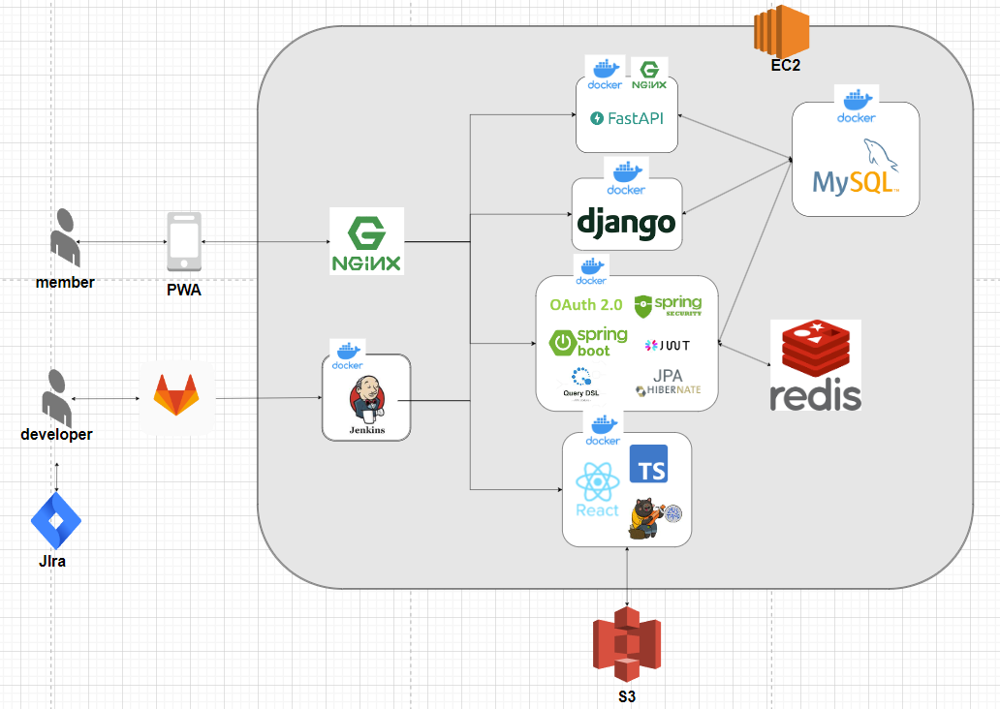

### 1️⃣ 프로젝트 개요

🌈 **개발 기간**

| 개발 기간 | 2024.02.26 ~ 2024.04.04(6주)|
| --- | --- |

🌈 **팀원 소개**

| 팀원 | 역할 |
| --- | --- |
| 김혁일 | 팀장, BE 리드, Infra(CI/CD), DB |
| 김재훈 | BE, 크롤링, DB, 서기 |
| 문신웅 | FE, 디자인, ,스크럼 마스터 |
| 박희찬 | AI, 크롤링, DB |
| 전재완 | BE, DB, 발표, Jira 담당자 |
| 정유나 | FE 리드, 디자인 |

### 2️⃣ 주요 기능

🌈 **노래 연습**

---

### 3️⃣ 기술 스택

---

### 4️⃣ 아키텍처

---

### 5️⃣ 협업 환경

- Gitlab
    - 코드 버전 관리
    - 이슈 발행, 해결을 위한 토론
    - git-flow 방식 활용

- JIRA
    - 
    - Scrum Poker를 사용하여 Story Point 설정
    - 3Deps 구조를 활용하여 진행
    - 팀원들의 역할 진행도 확인

- 회의
    - 매일 아침 스크럼 회의를 통하여 전날 목표 달성량과 당일 할 업무 브리핑

- Notion
    - 이슈 사항 기록
    - 컨벤션 정리
    - 

- Figma
    - 목업 제작, 와이어프레임 제작

- Miro
    - 아이디어 회의

- Canva
    - 발표 PPT 공유
