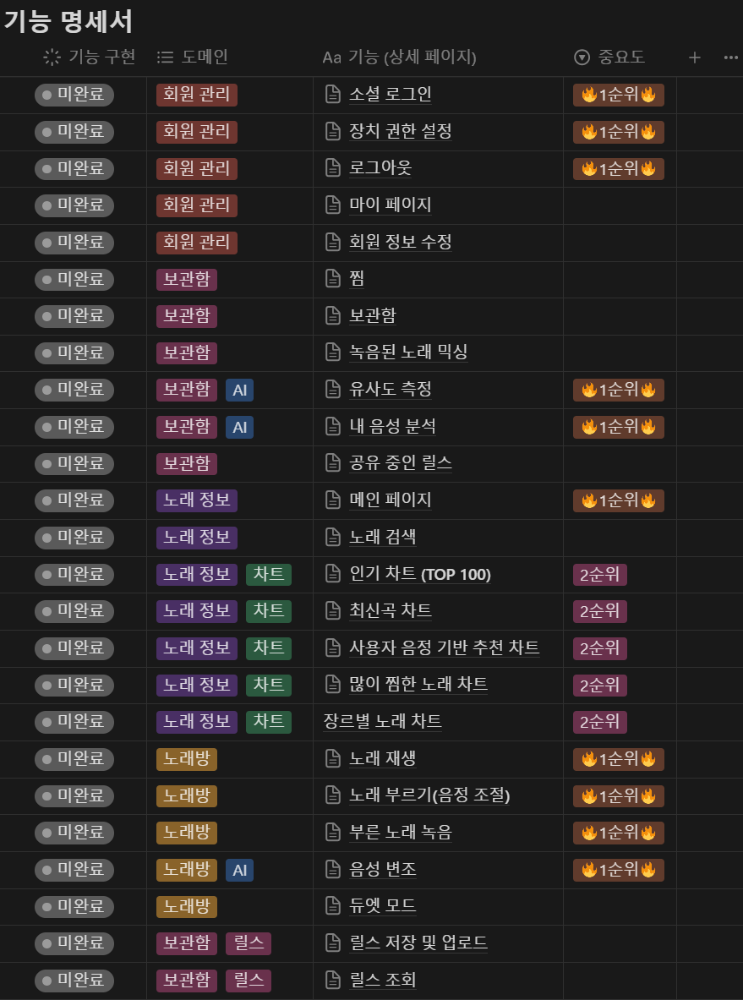
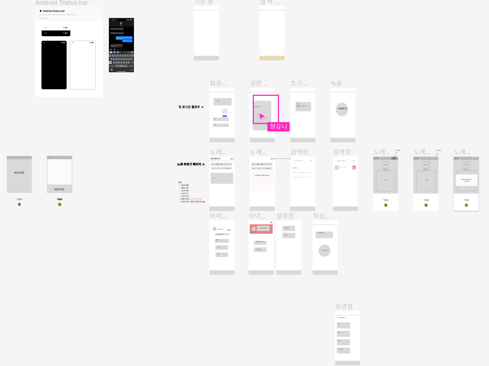

# 2024 - 03 - 05

## Spring Framework

### Controller
- 목적 :  HTTP 요청을 받아들이고 응답을 반환하는 역할을 한다. 주로 사용자의 입력을 처리하고, 사용자에게 피드백을 제공하는 데 사용된다.
- 사용 방법: @Controller 또는 @RestController 어노테이션을 사용하여 클래스를 정의. @GetMapping, @PostMapping 등의 어노테이션을 사용하여 HTTP 메소드에 따른 처리를 정의한다.

### DTO(Data Transfer Object)
- 목적 : 계층 간 데이터 교환을 위해 사용되는 객체. 특히, 네트워크를 통한 데이터 전송에 최적화 되어 있다. 데이터베이스 엔티티와는 다르게, DTO는 화면에서 사용자에게 보여주기 위한 데ㄴ이터 형태로 가공될 수 있다.
- 사용 방법 : 필요한 데이터 필드를 포함하는 클래스를 정의하고, @Getter, @Setter, @NoArgsConstructor, @AllArgsConstructor 등의 Lombok 어노테이션을 사용하여 코드를 간결하게 만들 수 있다.

### Entity
- 목적 : 데이터베이스의 테이블과 직접적으로 매핑되는 객체. JPA (Java Persistence API)를 사용하여 데이터베이스와의 CRUD (Create, Read, Update, Delete) 작업을 쉽게 할 수 있게 해준다.
- 사용 방법 : @Entity 어노테이션을 사용하여 클래스를 정의하고, @Id 어노테이션으로 기본 키를 설정한다. @Column 어노테이션으로 필드와 데이터베이스 컬럼을 매핑한다.

### Repository
- 목적 : 엔티티에 대한 데이터베이스 접근 로직을 캡슐화. Spring Data JPA를 사용하면 인터페이스만 정의하면 되며, 구현체는 Spring이 자동으로 생성
- 사용 방법 : @Repository 어노테이션을 사용하지 않아도 되지만, JpaRepository 인터페이스를 상속받는 인터페이스를 정의하여 사용

### Service
- 목적 : 비즈니스 로직을 처리. 컨트롤러와 레포지토리 사이에 비즈니스 로직을 수행하며, 여러 레포지토리의 조합이 필요한 경우 조정한다.
- 사용 방법 : @Service 어노테이션을 사용하여 클래스를 정의

## 회의
## 노래방을 왜 가는지?

신웅

- 노래를 불러도 되는 공간이니까 부담이 없다
- MR로 부를 수 있다
- 마이크가 빵빵하다 (에코)
- 큰 소리로 부를 수 있다
- 평소에 흥얼거리던 노래를 진심으로 불러보러 가기 (이거 불러지나?)

희찬

- 그것이 노래방이니까.
- 술먹고 신나서2222
- 혼자 갬성 오질때
- 주변 신경 안쓰고 지르고 싶을 때

재훈

- 술먹고 신나서
- 약속까지 비는 시간이 있어서
- 배가 너무 불러서 소화시키려고

유나

- 이게 다같이 큰소리로 부르기엔 노래방만한게 없긴합니다…
- 그냥 뜬금없이 노래방이 땡길때가 있습니다..
-

혁일

- 노래방만의 맛(분위기)이 있다. 집에서는 뭔가 제대로 부르기 힘들다. 집에서 부르면 뭔가 아쉽다.
- 신나게 크게 부르는 맛이 있다

재완

- 스트레스 해소
- 여러명이 같이 즐기기 위해서
- 고성방가
-

큰소리로 부른다,,, 노래방 분위기,,, ⇒ 이걸 대체할만 할? 재미있는 컨텐츠가 필요해보이네요.

- 기존 노래방 서비스에 추가적인 컨텐츠, 기능을 붙이는 방향으로 진행?
    - 목소리가 입력 되면

---

## 기획 의도

- 전문가가 아닌 일반인 입장에서 부르고 싶은 노래를 내 목소리에 맞춰
  음정을 조절하기가 쉽지 않기에, 자동으로 내 목소리를 파악해서 알맞는
  음정으로 맞춰주고 노래를 편하게 부를 수 있으면 좋겠다.
- 내가 좋아하는 가수의 노래를 내 목소리가 아닌 가수의 목소리로 다른 노래를 불러보거나 컨텐츠를 즐길 수 있다면 재미있을 것 같다.
- 루즈할 때 즐기기 좋은 컨텐츠가 마땅히 없다.
- 위치나 시간 상 친구들과 만나서 놀기에 제약이 있을 때

페르소나

1. **미소녀 뮤지션**:
    - 이름: 지은
    - 나이: 22세
    - 직업: 대학생 및 아마추어 가수
    - 취향: K-pop, 팝, 록 등 다양한 장르를 좋아하며, 자신의 노래 실력을 더욱 향상시키고 싶어함.
    - 목표: 다양한 음악을 부르며 노래 실력을 향상시키기 위해 노래방을 자주 이용하는 것을 즐김.
2. **직장인 취준생**:
    - 이름: 성우
    - 나이: 27세
    - 직업: 신입 사무직 직장인을 희망하며 취업준비생
    - 취향: 힙합, 발라드 등 다양한 음악을 좋아하지만, 스트레스 해소를 위해 가끔은 락 노래도 부름.
    - 목표: 친구들과 함께 노래방에서 스트레스를 풀며 취업 준비의 피로를 푸는 것을 즐김.
3. **가족과 시간을 보내는 집순이**:
    - 이름: 민재
    - 나이: 35세
    - 직업: 주부 및 가정 주부
    - 취향: 80년대, 90년대 팝송과 발라드를 좋아하며, 자녀와 가족들과 함께 노래방을 즐기는 것을 취미로 삼음.
    - 목표: 가정에서의 시간을 즐기며 가족과 함께 즐거운 추억을 만들기 위해 주말마다 노래방을 방문함.

## 소비자의 needs

- 노래방의 음정 조절 기능은 음악적 지식이 없으면 사용자 설정이 힘들다.
- 최애의 목소리로 노래를 불러 볼 수 있다 (덕질)
    - 내가 그 가수의 목소리로 노래를 불렀을 때 실력이 어느 정도인지?
- 내가 좋아하는 노래를 얼마나 잘 불렀는지 알고싶다
- 심심할 때 재미를 느끼기 위해
- 친구들과 떨어져 있을 때 같이 즐길 거리가 필요하다.
- 성별이 다른 노래를 자연스럽게 부르고 싶다

## 목표

- 즐겁게 시간을 죽일 수 있다. ??
- 원하는 노래를 안정적으로 부를 수 있는 음정 제공

----------------
# 2024 - 03 - 06

## 전문가 리뷰
### 프로젝트 소개

1. 목소리를 사전에 학습해서 노래의 음정을 우리의 목소리에 맞게 맞춰주는 기능
2. 사용자 목소리를 유명인이나 다른 스타일로 변조해서 활용하는 기능
3. 유사도를 측정해서 활용하는 기능

- 기술
    - 음역대 측정(클라이언트) : JS의 Web Audio API
    - 음악의 음역대 측정(서버) : 파이썬 Librosa 라이브러리
    - 프론트 : 리액트, pwa
    - 백엔드 : 스프링부트

### 멘토 발언

- 팀 이름 의미 질문
- 팀 인원 구성 질문 (프론트2, 백4(AI포함))
    - 백엔드 인원의 1~2명이 AI관련 업무를 하는게 적당하다.
    - 나머지는 정통 백엔드 업무 수행
- 음성을 모델 학습이든 라이브러리 사용이든 데이터가 필요하다. 데이터를 어떻게 확보를 할 것인가?
    - 혁일 : 노래 데이터는 따로 가져올 수 있다고 알아서 구체적으로 찾아보지는 않았고, 활용한다.
    - 희찬 : 공개 음성 모델이나 허깅페이스에서 구한다.
- 수동으로 음정을 맞추는 경우를 생각한다면,
    - 일단 수동으로 조절하는 기능 자체는 만들어야 한다.
    - 누군가는 테스트를 통해서 제대로 조정이 되고있는가를 확인해야 한다.
    - 그래서 위와같은 구성을 일단 만들고 확인해야한다.
- 시스템 구성한게 있는가?
    - 어떻게 아직 개발할지는 구체적으로 못했다.
        - 얼른 각자 맡은 부분에서 어떻게 구성하고 어떻게 할지 **시스템 구성**을 해야한다.
        - AI학습을 동시에 염두해둔다.
        - 스케줄 조정을 해야한다.
        - 기간이 그렇게 길지가 않기 때문에(약 1달 미만)
        - 2~3주 내에 수동 음정 조정을 만들고, 그 동안 AI 담당은 동시에 음정 자동 조정 파트를 만들어서(학습 등) 두가지를 합친다.
        - 그 뒤에 리버브나 다른 기능을 추가한다.
        - 일단 뼈대를 만들고 살을 붙여라
        - 본인의 역할들을 정하고, 같이 얘기 하면서 진행하고 합친다.
        - 음정 수동 조정과 AI 자동 조정이 잘 작동하고 정확한지 위 기간동안 확인해야한다.
        - 기간을 생각하면 굉장히 정밀하게 하기가 힘든다.
        - 우선 남자냐 여자냐를 구분하는걸로 시작한다.
        - 그 후에 남녀에서 음이 높은사람, 낮은사람 구분
        - 그 후에 톤 등을 구분
        - 이렇게 진행하면 조합을 하면 굉장히 다양해진다
- 사용자가 얘기하는 음성을 어떤 방식으로 전달 받을 것인가?
    - pwa를 사용해서 핸드폰으로 사용한다면, 핸드폰 마이크로 사용한다.
        - 서비스를 만드는 것이니까 os앱 기반으로 할 것인가 웹 기반으로 할 것인가를 정해야 한다.
        - 입/출력도 생각 해야하기 때문에.
        - 환경을 먼저 정의하는게 중요하다.
        - 어떤 기술을 사용할지에 따라서 환경이 달라질 수도 있지만, 일단 환경을 먼저 정의하는게 좋다.
        - 안드로이드 앱이 유연해서 좋다.
- 목소리의 음정이 떨리느냐 안정적이냐 등, 음정의 파장을 분석하는게 중요하다.
- 제대로 한다하면, 고급 마이크를 가지고 전자 파형을 분석하는 형태로 프로젝트를 진행 해야한다.
- 그 파형을 데이터화 해서 AI가 학습한다.
- 그 중간중간에도 음성 데이터는 계속 필요하다. (일단 노래를 부른다.)
- 자료 없이 시작을 하는 경우에 데이터가 많지 않아서 일단 데이터를 모으는게 중요하다.
- 조원들은 일단 노래를 부르자
- 취업을 한다고 하면, 데이터는 얼마나 썻고 어떤식으로 활용했나를 첫 질문으로 물어본다.
- 전체적인 프로젝트의 방향성과 일정을 구체화 시킨다 → 그 후 기술적인 부분을 생각한다.
- 일단 멘토의 생각은 조금 더 구체화를 시켜야한다.
- 얼추 생각을 해보면 **역할 분담**, **일정 조정**, **엔드 포인트**가 무엇이냐를 협의해라
- 우선 4주보단 1,2주 단위로 최종 목표에 대한 로드맵을 구성해라

## 기능 구체화 회의
1. 사용자 음정 맞춤
- 사용자가 노래를 선택하여 부르면, 사용자의 목소리를 분석 후 노래의 음정을 보정해줌.
    - Ex) 원곡보다 사용자의 음역대가 낮다면, 키를 낮춰 보정.
    - Ex) 성별과 다른 노래를 불렀다면, 해당 성별에 맞게 키를 보정.
        - 사용자 음역대 데이터를 사전 학습 필요.
        - 사용자 목소리 저 장!

2. 변조 모드
- 변조해서 들어보고 저장도 가능 (변조가 유명인 말고도 자신의
    - 이거로 어떤 재미를 느낄 수 있을까?
    - 예 ) 녹음 →
    - 랜덤 변조 → 커뮤니티(릴스?)에 자랑
        - 메인 1번 기능에서 노래를 부른 후에, 후처리로 변조 유무 선택, 변조해서 저장 및 자랑

3. 자유로운 노래방 놀이터
듀엣 모드
- 혼성 곡이 많음 → **근거 데이터 제시 가능**
- 듀엣 곡을 혼자서 완창하기보다, 원하는 노래와 필요한 성별을 제시하면 자유롭게 참가하여 서로 부를 수 있음.

4. 소셜 로그인
- 카카오 로그인

5. 추천 기능
- 추천 알고리즘
----------------
# 2024 - 03 - 07

## 기능 명세서


## 와이어프레임

------------------------
# 2024 - 03 - 08

## 추천 시스템 알고리즘 조사

### **1. 콘텐츠 기반 필터링**

- 대상 자체의 특성을 바탕으로 추천하는 방법론
- 콘텐츠 기반 필터링은 곡 자체에서 정보를 뽑아내기 때문에 딥러닝이 개입할 여지가 많습니다. 오늘날에는 손으로 피쳐를 만들기보다는 딥러닝을 많이 사용하고 있다.
    - 오디오 데이터 처리 형태 비교


- 오디오 데이터를 처리하기 위해서 어떤 형태로 오디오 정보를 입력받을지 결정해야 하는데, 가장 단순한 방법으로는 오디오 웨이브 데이터를 있는 그대로 넣어서 처리하는 모델을 생각해 볼 수 있습니다.
- 이러한 형태를 엔드 투 엔드(end-to-end)라고 한다.
    - 웨이브 형태의 데이터를 그대로 넣기 때문에 별다른 사전 처리를 하지 않아도 된다는 장점이 있지만, 모델이 배워야 할 필터의 종류가 많기 때문에 모델이 충분히 학습되려면 전문 지식을 통해서 처리한 결과를 넣어주는 것보다 훨씬 많은 데이터를 필요로 합니다.
    - 웨이브 시그널을 짧은 시간별로 잘라서 각 조각마다 **푸리에(**Fourier) 변환을 취한 후 붙이면 해당 오디오의 2D 표현을 얻을 수 있습니다.
    - 우리의 달팽이관은 인접한 주파수와 높은 주파수 대역은 잘 구분하지 못하기 때문에, 이런 인간의 청각적 지각 능력에 맞춰서 로그 스케일로 스펙트로그램의 주파수 축을 줄이고 이 값들을 몇 개의 주파수 대역대로 묶으면 크기를 줄이는 동시에 가장 중요한 정보들을 보존할 수 있는 **멜 스펙트로그램(mel-spectrogram)**을 만들 수 있습니다.


### **2. 협업 필터링**

- **행렬 분해 (matrix factorization)**
    - 다른 사람들이 들은 곡들을 바탕으로 어떤 곡들이 서로 비슷한지를 알아내는 방법
    - 모든 데이터에서 무조건 딥(Deep) 구조를 사용한다고 결과가 뛰어나지는 않습니다. 데이터의 구조와 특성에 따라서 모델을 선택해야 하는데, 협업 필터링을 활용한 추천에서는 얕은 모델들이 아직까지는 상당 부분 우위를 점하고 있습니다.
    - 유저가 어떤 곡을 소비했는지 여부를 **유저 x 곡 매트릭스**로 표현한 후 이 매트릭스를 **랭크가 작은 두 개의 매트릭스**로 나누고**,** 이렇게 두 개로 나눈  매트릭스의 곱이 **원래의 매트릭스와 비슷하게 나오도록** 학습하는 방법

  

- **오토인코더(autoencoder)**
    - 행렬 분해와 비슷하게 입력 데이터를 원래의 차원(dimension) 보다 적은 데이터로 줄인 후에, 변환한 데이터를 기반으로 원래의 데이터를 복원하는 구조로 되어있다.


### **3. 고객 행동에 기반하여 점수를 메기는 단순 룰 베이스 방식의 추천**

- 고객이 본 상품 상세 페이지, 장바구니에 담았던 상품들의 이력을 추천하여 단순히 1점씩 매기고 점수가 높은 순으로 추천을 하는 룰 베이스 방식의 추천 기법

```sql
고객A가 과거 2개월 동안 e-커머스 서비스 안에서 취한 행동

수박 : 상세 페이지 클릭 10번, 장바구니 담기 2회 – 총 12점
딸기 : 상세 페이지 클릭 9번, 장바구니 담기 4회 – 총 13점
연어 : 상세 페이지 클릭 3번, 장바구니 담기 5번 – 총 8점
팽이버섯 : 상세 페이지 클릭 2번, 장바구니 담기 7번 – 총 9점  
```

### 필터 버블(Filter Bubble)

- 만약 A커머스에서 화장품만 구매한다면, 계속해서 알고리즘은 화장품만을 추천해준다. A커머스에서 양질의 도서 상품이나 의류를 판매하더라도 그러한 상품 정보들을 접할 기회가 적을 것이다.
- 정보가 양극화되는 현상, 고객의 입맛 외의 정보가 숨겨지는 현상

실시간 개인화 추천 시스템 구축에 대한 문제

- 학습 데이터가 많아지면 메모리 사용량이 급격히 늘어나거나 학습 속도가 느려짐
- 사용자 정보를 ID의 단일 값이 아닌 다양한 정보를 활용하기 유연하지 않음
- 실시간으로 빠른 추천 구현에 대한 고려가 부족

### 4. 딥러닝 추천 시스템 (tow-stage)


- 사용자에게 추천할 후보군을 수백개 뽑는1단계 후보 모델, 그리고 그 수백개의 후보들이 사용자가 얼마나 관심 있을지 점수를 계산하는 2단계 랭킹 모델
- 2단계로 나눈 이유 : 추천할 대상이 많아 사용자가 모든 글에 대한 관심 점수를 계산하기에는 너무 오래 걸리기 때문에 추천할 후보를 대략적으로 빠르게 추린 후 랭킹 점수를 계산하여 다시 정렬하기 위하여
